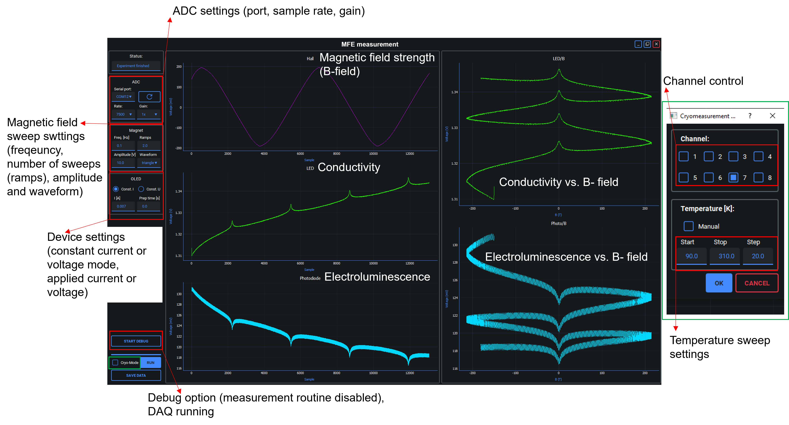

# Organic MFE Measurement


## Table of Contents
- [Decription](#description)
- [Installation](#installation)
- [Usage](#usage)
- [Features](#features)
- [Hardware Requirements](#hardware-requirements)
- [Want to know more about us?](#want-to-know-more-about-us)

## Description
### Overview
This repository contains code developed to measure the current and electroluminescence dependence of a light-emitting device under the influence of a magnetic field. The effect under investigation is known as the Organic Magnetic Field Effect (MFE). For more information, refer to:

- [Morgenstern *et al.*, Analysis of polaron pair lifetime dynamics and secondary processes in exciplex driven TADF OLEDs using organic magnetic field effects](https://www.nature.com/articles/s41598-024-82060-z)

- [Ehrenfreund and Vardeny, Effects of Magnetic Field on Conductance and Electroluminescence in Organic Devices](https://onlinelibrary.wiley.com/doi/full/10.1002/ijch.201100120)

By applying this technique, Zeeman splitting is induced, lifting the degeneracy of triplet excited states. This enables the identification of charge carrier transport mechanisms via their characteristic response curves. Additionally, the driving forces behind spin-pair state interconversion (*e.g.*, from triplet to singlet) and spin dynamics in loosely bound electron-hole pairs (polaron-pairs) can be analyzed.

### Features
#### Measurement Control Interface

The measurement process is fully controllable via a graphical interface, which is depicted in the following image. 

Key capabilities include:

- Adjustable magnetic field sweep frequency

- Choice of measurement mode: constant voltage or constant current

- Temperature-controlled measurements (e.g., at cryogenic or room temperature)

- Debug and Save option

- Real-time display of:

    - Conductivity

    - Electroluminescence

    - Magnetic field strength via hall voltage

Measurement results (*e.g.*, conductivity and electroluminescence vs. magnetic field) are visualized live on the interface.

#### Cryostat Integration
When using a cryostat, it is recommended to use a relay switch box, enabling automated measurement of multiple pixels on the same device, without the need for manual intervention. This is available under the "Cryo Mode" setting. For non-cryogenic measurements, this option can be ignored.

### Data Analysis and Post-Processing
A post-processing tool is included to compute the OMFE using the formula:

\[
\text{MFE}(\%) = \frac{\text{MFE}(B) - \text{MFE}(B=0)}{\text{MFE}(B=0)} \times 100
\]


Additional analysis features:

- Calculation of magnetoefficiency

- Data fitting with implemented functions:

    - Lorentzian profiles

    - Cole-Cole functions

- Model selection using metrics such as:

    - Bayesian Information Criterion (BIC)

    - Mallows' Cp and others


All fitting parameters are saved separately for reproducibility.
Please note, that the post-processing routine deactivates the following steps: 
- Split of the data set according to B (if there are several ramps measured, they will be splitted accordingly)
- Remove of faulty ramps (only first and last ones are removed, this function could be adjusted by *e.g.* outlier detection)
- Low-pass filter 
- Correct signal by amplifier delay times
- Calculate relative change 
- OLED decay substraction
- Model fitting and evaluation

For each ramp a seperate file will be generated and all ramps from the same measurement will be stored in the same folder together with the extracted fitting parameters, namely *ramp data*. If one uses Cole-Cole fitting function approach, the polaron-pair lifetime distribution is automatically generated and stored within the same folder. 
The settings can be chosen after running the processs_gui.py (see below).

As additional columns are saved for the temperature dependent measurements (*Cryo mode*), it has to be enabled in the settings accordingly. **Please note that when dragging the folder of interest, the expected structure must be: folder/folder_of_interest/raw_data**

### Further Reading
More detailed experimental and theoretical background is available in the following publications:

- [Morgenstern *et al.*, Analysis of polaron pair lifetime dynamics and secondary processes in exciplex driven TADF OLEDs using organic magnetic field effects](#https://www.nature.com/articles/s41598-024-82060-z)


## Installation

```bash
git clone https://github.com/semiconductor-physics/Organic-MFE-Measurement.git
cd Organic-MFE-Measurement
pip install -r requirements.txt
```

## Usage

Before the first start you need to copy and rename the configuration templates once:

### Powershell/Bash:
```bash
cd Config
cp experiment_config_template.yaml experiment_config.yaml
cd ../processing
cp process_config_template.yaml process_config.yaml
```

### Windows CMD:
```bash
cd Config
copy experiment_config_template.yaml experiment_config.yaml
cd ../data_processing
copy process_config_template.yaml process_config.yaml
```


The measurement can be run through the GUI by running the command

```bash
python main.py
```

The GUI for the raw data processing can be started using

``` bash
cd processing
python processing_gui.py
```

## Hardware Requirements

The full description of the hardware can be found in the publication: 
The measurement is designed for the following hardware requirements: 
- hp 8116 A function generator 
- KEPCO Bipolar Power Supply 
- Keithley SMU 2636A 
- Stanford Research Systems Low-Noise Current Preamplifier 
- Keithley Multimeter 2010 
- ChenYang CYSJ2A-T Hall sensor 
- Data acquisition system (self-made, containing and ESP-32 microcontroller and a 24-bit ADC ADS1256 from Texas Instruments
in a 11010 high-precision AD/DA board from waveshare). Details for the DAQ can be found in the publication mentioned above.
- photodiode (Hamamatsu S1227-1010BQ)

For the temperature dependent measurments the following hardware is additionally required: 
- Oxford instruments Temperature controller ITC S035 
- Oxford Cryostate 
- Relay switch box (if several channels have to be operated automatically, e.g. several pixels on one OLED device)
- pt100 

## Want to know more about us?
The project was designed by the [Magnetooptics group at Chemnitz University of Technology](https://www.tu-chemnitz.de/MAIN/magnetooptik/index.html)

For further questions please do not hesistate to contact us: github-hlph@physik.tu-chemnitz.de

The project was funded by the Deutsch Forschungsgesellschaft (DFG) through DFG-TRR 386-B05/B06 (514664767) and by the Sächsische Aufbaubank (SAB) under the project number 100649391 (ReSIDA-H2). 
